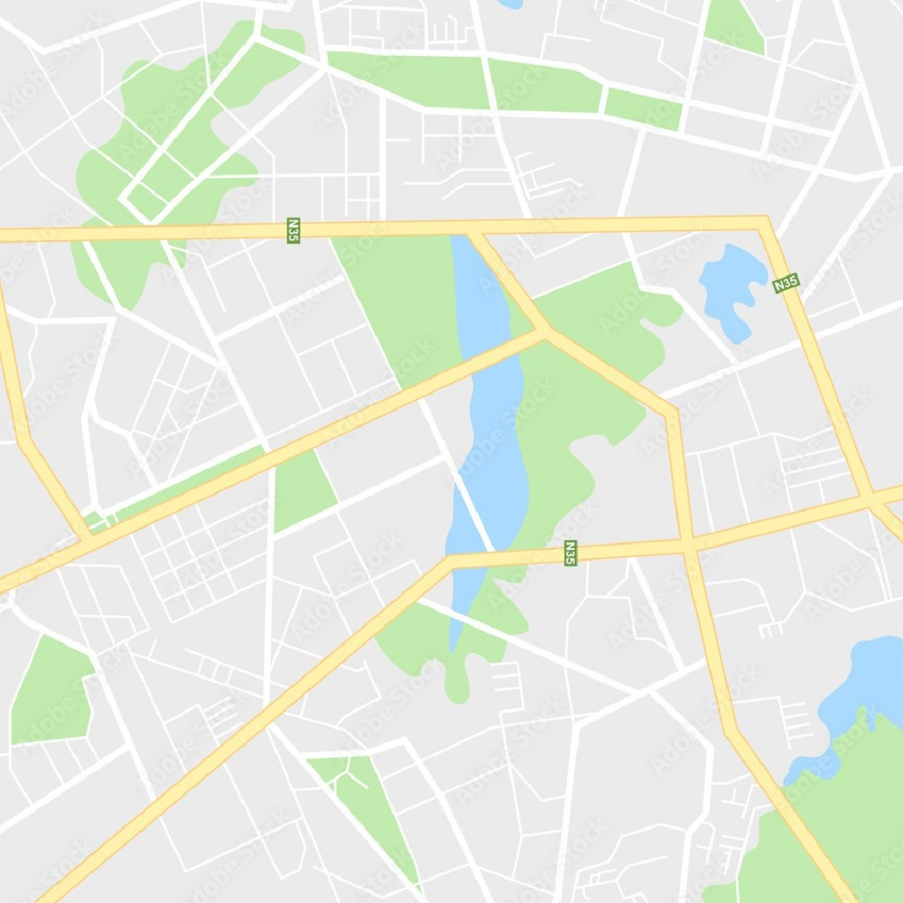
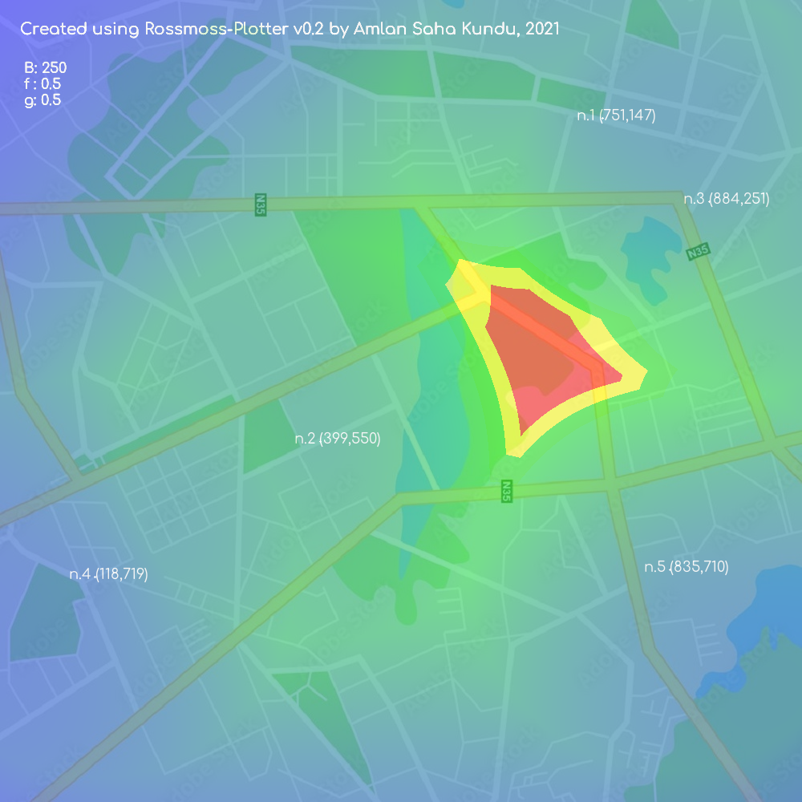

# Rossmo Plotter
A tool to plot and execute Rossmos's Formula using python, that helps to catch serial criminals using mathematics

Author: Amlan Saha Kundu
version: 0.2

---

Rossmo's formula is a geographic profiling formula to predict where a serial criminal lives. It relies upon the tendency of criminals to not commit crimes near places where they might be recognized, but also to not travel excessively long distances. The formula was developed and patented in 1996 by criminologist Kim Rossmo.

## Formula:


where, 

As we can see from the equation, we need a few parameters to plot the probability-distribution on the map.
-  Number of Crimes committed and there corresponding co-ordinates on the map (in pixel)
-  Buffer radius (B)
-  constants f and g

## What this software does
Rossmos Plotter create arbitrary crime scene based on a given map and plot probability distribution of each pixel using Rossmos's formula. 
As an example, take the following map:



Suppose, 5 crimes have been committed on the above map, which follows almost same pattern. Based on other circumstancial evidences, the investigator concludes that, they have been committed by the exact same individual. Now, under such circumstances, we may take help from Rossmo's function and narrow down our preferences and search radius to catch theat criminal.

### **Crime data**

| Sl. No.  | X-Coordinate | Y-Coordinate | Weightage of the Crime (1-100) |
|----------|--------------|--------------|--------------------------------|
| 1 | 751 | 147 | 20 |
| 2 | 399 | 550 | 20 |
| 3 | 884 | 251 | 20 |
| 4 | 118 | 719 | 20 |
| 5 | 835 | 710 | 20 |

### **Generated Output for a Specific Value of parameters**

This is the generated output for B (Buffer Radius) = 250, f = 0.5, g = 0.5



This is the generated output for B (Buffer Radius) = 250 and variable f and g (with iteration limit 0.1)


## How to Run this app

Make sure you have ```python 3.7 or higher``` and ```git``` installed on your machine. Now, open up your terminal and run the following commands: 

```
git clone https://github.com/yoursamlan/Rossmo-Plotter.git
cd Rossmo-Plotter
pip install -r requirements.txt
python Rossmo-Plotter.py
```
