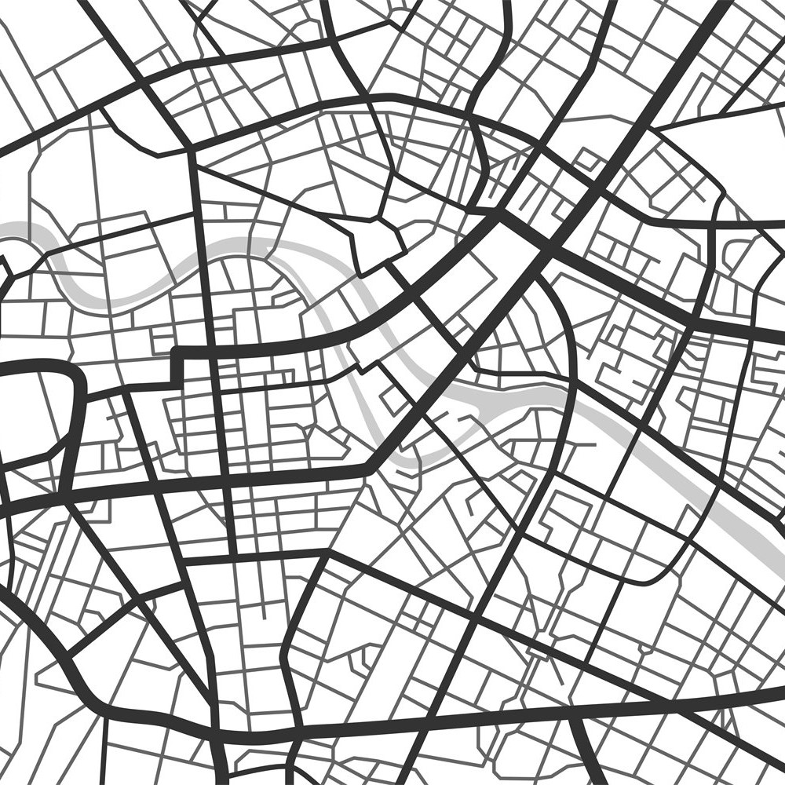

# Rossmo Plotter
A tool to plot and execute Rossmos's Formula using python, that helps to catch serial criminals using mathematics

---

Rossmo's formula is a geographic profiling formula to predict where a serial criminal lives. It relies upon the tendency of criminals to not commit crimes near places where they might be recognized, but also to not travel excessively long distances. The formula was developed and patented in 1996 by criminologist Kim Rossmo.

## Formula:

where, 

As we can see from the equation, we need a few parameters to plot the probability-distribution on the map.
- 1. Number of Crimes committed and there corresponding co-ordinates on the map (in pixel)
- 2. Buffer radius (B)
- 3. constants f and g

## What this software does
Rossmos Plotter create arbitrary crime scene based on a given map and plot probability distribution of each pixel using Rossmos's formula. 
As an example, take the following map:

